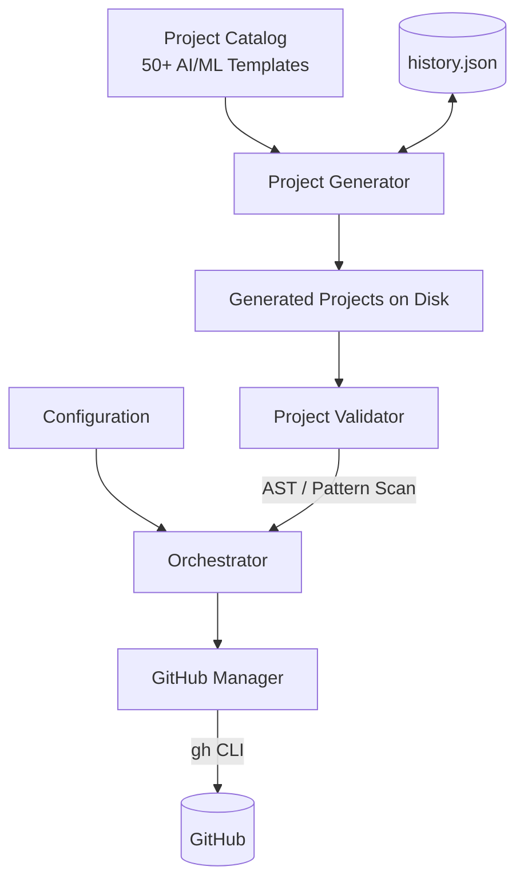

# Daily GitHub Agent - AI/ML Project Factory

An automated project factory that generates high-quality AI/ML projects and automatically creates and pushes them to GitHub as brand-new repositories.

## Overview

The Daily GitHub Agent acts as an automated software architect. Every day, it:
1. Selects an unused project idea from its extensive AI/ML taxonomy
2. Generates the complete, runnable Python project structure on disk
3. Validates the code for syntax correctness and checks for leaked secrets
4. Initializes a local Git repository
5. Uses the GitHub CLI to securely create a new remote repository
6. Pushes the code and records the success to prevent duplicates

## Architecture



## Features

- **Extensive Taxonomy**: 50+ project templates covering Machine Learning, Deep Learning, NLP, RAG, Generative AI, MLOps, Computer Vision, and AI Security.
- **Runnable Code**: Generates real implementations using `scikit-learn`, `PyTorch`, `LangChain`, `OpenAI`, etc., instead of placeholders.
- **Robust Validation**: Ensures generated code has valid Python syntax and contains no leaked secrets before pushing.
- **Secure Authentication**: Relies entirely on the GitHub CLI (`gh auth login`). No API keys or tokens are stored in the code or environment variables.
- **Duplicate Prevention**: Keeps a local JSON history of all generated repositories.

## Installation & Requirements

Ensure you have the following installed:
- Python 3.9+
- Git
- GitHub CLI (`gh`)

```bash
git clone <this-repo>
cd daily-github-agent
python -m venv venv
source venv/bin/activate  # On Windows: venv\\Scripts\\activate
pip install -r requirements.txt
```

### GitHub CLI Setup

The application uses the authenticated GitHub CLI to interact with your account.
Run the following and follow the prompts:

```bash
gh auth login
```

## How to Run

### 1. Dry Run (Recommended)

Always test generation locally first without pushing to GitHub.

```bash
python main.py --dry-run
```
This generates the project in the `generated_projects/` directory and validates it.

### 2. Full Run

Generate the project and push it to GitHub:

```bash
python main.py
```

### 3. Generate a Specific Project

```bash
python main.py --target "hybrid-rag-search-engine"
```

## Future Roadmap

- **Phase 2:** Integrate LLM APIs (OpenAI/Anthropic) to dynamically design architectures and write code, transitioning from templates to true AI generation.
- **Phase 3:** Automated daily scheduling (via cron or cloud schedulers) to create an autonomous project factory.
- **Phase 4:** Expand to multi-file complex architectures with Docker and CI/CD pipelines included out-of-the-box.
